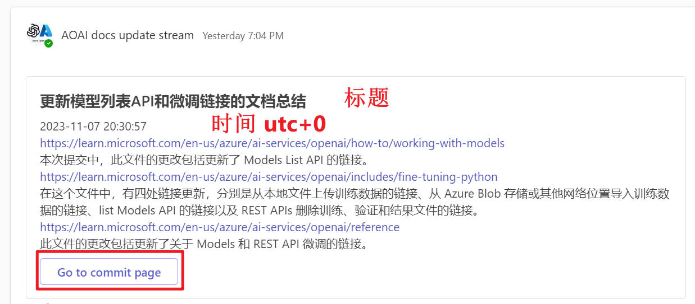

# User Interface

Users can see the following notifications in Teams Channel.

- The title is generated by GPT4.
- The second line shows the UTC time of the update.
- The body contains a summary of the updates made to different documents by GPT4. For example, in the example provided, three documents were updated.
- Clicking on the link takes you to the official documentation.
- The "Go to commit page" button at the bottom takes you to the commit page on GitHub..

# Commit Page

https://github.com/MicrosoftDocs/azure-docs/commit/4189b431df9d28d94f54661e223c318335bcb9f2

You can see that this update involves modifications to three files, which is consistent with the summary provided by GPT4.
The left side shows the version before the update, and the right side shows the version after the update.

By clicking on the Preview button in the upper right corner, you can see the updated content more intuitively.

https://github.com/MicrosoftDocs/azure-docs/commit/4189b431df9d28d94f54661e223c318335bcb9f2

# Implementation :

- Taking Azure OpenAI Documents as an example, each update to the documentation is recorded on this page: https://github.com/MicrosoftDocs/azure-docs/commits/main/articles/ai-services/openai.
- We can get the history
- Crawl the update content of each commit.
- Submit the update content to GPT4 for summarization and generate a title.
- Push the summary generated by GPT4 to Teams Channel through the Teams Channel Webhook.
- The program checks for new commits every 2 hours.

# Running Configuration

1. pip install -r requirements.txt
2. Create a copy of .env.example, rename it to .env

   - [Link your GitHub and Microsoft accounts](https://review.learn.microsoft.com/en-us/help/get-started/setup-github?branch=main&branchFallbackFrom=master#2-link-your-github-and-microsoft-accounts)
   - [generate github access token](https://docs.github.com/en/enterprise-server@3.6/authentication/keeping-your-account-and-data-secure/managing-your-personal-access-tokens)
   - [Authorizing a personal access token for use with SAML single sign-on](https://docs.github.com/en/enterprise-cloud@latest/authentication/authenticating-with-saml-single-sign-on/authorizing-a-personal-access-token-for-use-with-saml-single-sign-on)

     
   - [create Azure OpenAI resource. Please use GPT-4!](https://learn.microsoft.com/en-us/azure/ai-services/openai/how-to/create-resource?pivots=web-portal)
   - [create cosmosdb account, database, container, and get the key.](https://learn.microsoft.com/en-us/azure/cosmos-db/nosql/quickstart-portal)
3. Create a copy of last_crawl_time.txt.example, rename it to last_crawl_time.txt

   - For the initial setup, the bot will only process changes after the specified timestamp(UTC+0).
   - If the file is not manually created, the bot will create a new one and put current time into it.
   - [related code.](https://dev.azure.com/GCR-AI-IoT-Team-Operation/_git/DocUpdateNotificationBot?path=/app.py&version=GBmaster&line=110&lineEnd=135&lineStartColumn=1&lineEndColumn=60&lineStyle=plain&_a=contents)
4. Create a copy of target_config.json.example, rename it to target_config.json
5. cd /home/user/DocUpdateNotificationBot
6. nohup python3 app.py &
7. tail -f ./logs/log.txt -n 20

# How to get root_commits_url used in target_config.json?

### Switch to Rest API URL:

   /main/        =>   ?path=

github.com   =>   api.github.com/repos

For example:

https://   ~~github.com~~   /MicrosoftDocs/azure-docs/commits   ~~/main/~~   articles/ai-services/openai/

=>

https://   **api.github.com/repos**   /MicrosoftDocs/azure-docs/commits   **?path=**   articles/ai-services/openai

# How to create Teams Channel Webhook

https://learn.microsoft.com/en-us/microsoftteams/platform/webhooks-and-connectors/how-to/add-incoming-webhook?tabs=dotnet

# Set url_mapping in target_config.json

# Architecture

# 中文介绍

# 用户界面

用户可以在Teams Channel中看到以下推送。

- 最上方是GPT4给出的标题
- 第二行是更新的UTC时间
- 主体内容是GPT4对这次更新涉及到的不同文档的总结。比如例子中涉及了三个文档的更新。
- 点击链接可以进入官方文档。
- 最下方的“Go to commit page”按钮，可以跳转到GitHub的commit页面。

# Commit Page

https://github.com/MicrosoftDocs/azure-docs/commit/4189b431df9d28d94f54661e223c318335bcb9f2

可以看到这次更新涉及了三个文件的修改，和GPT4给出的总结一致。
左边是更新前的版本，右边是更新后的版本。

通过点击右上角的Preview按钮，可以更直观地看到更新的内容。
https://github.com/MicrosoftDocs/azure-docs/commit/4189b431df9d28d94f54661e223c318335bcb9f2

# 原理：

- 以Azure OpenAI为例，文档的每次更新记录都会记录在 https://github.com/MicrosoftDocs/azure-docs/commits/main/articles/ai-services/openai 这个页面。
- 爬取每一个commit的更新内容
- 提交给GPT4进行总结，生成标题
- 通过Teams Channel Webhook将GPT4的总结推送到Teams Channel
- 程序每小时会去查询是否有新的commits生成

# 运行配置

1. pip install -r requirements
2. 按照.env.example的示例创建.env文件
3. 按照last_crawl_time.txt.example的示例创建last_crawl_time.txt
4. 按照target_config.json.example的示例创建target_config.json文件

# How to create Teams Channel Webhook

https://learn.microsoft.com/en-us/microsoftteams/platform/webhooks-and-connectors/how-to/add-incoming-webhook?tabs=dotnet
