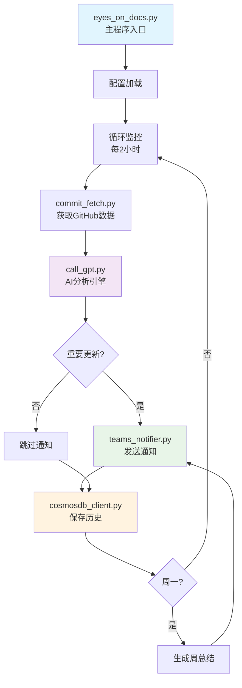
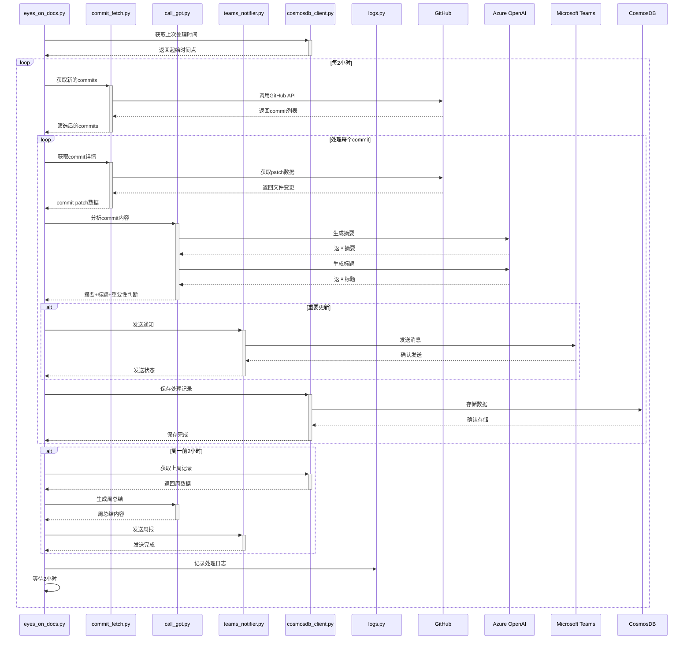
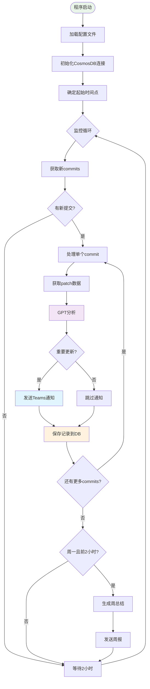
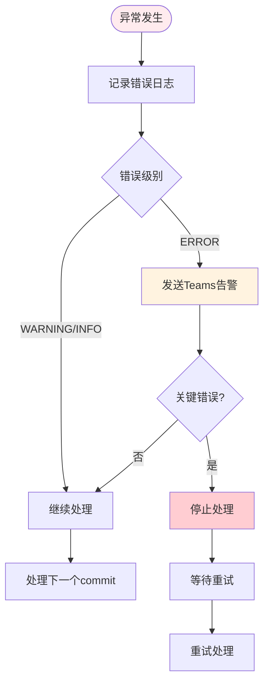

# Eyes-On-Docs 项目概述

## 项目简介

**Eyes-On-Docs** 是一个智能化的文档更新监控和通知系统，专门设计用于监控Microsoft Azure相关文档的更新，并通过Microsoft Teams发送AI驱动的智能通知。该系统能够自动识别重要的文档更新，生成高质量的摘要，并及时通知相关团队成员。

## 核心功能

- 🔍 **自动监控**：定期监控GitHub仓库的文档更新
- 🤖 **AI分析**：使用GPT模型分析更新内容的重要性和生成摘要
- 📝 **智能摘要**：自动生成简洁明了的更新摘要和标题
- 📢 **Teams通知**：发送格式化的Microsoft Teams通知
- 💾 **历史记录**：存储所有处理历史用于分析和审计
- 📊 **周报生成**：自动生成每周文档更新总结

## 系统架构图



## 详细工作流程



## 模块详细说明

### 1. 主程序模块 (`eyes_on_docs.py`)

**功能**：项目的主控制器和程序入口

**核心职责**：
- 加载配置文件(`target_config.json`)和AI提示词(`prompts.toml`)
- 管理监控循环，每2小时执行一次检查
- 支持多目标监控，可同时监控多个文档主题
- 协调各个功能模块的工作
- 处理周总结的生成和发送

**配置管理**：
```json
{
  "topic_name": "Azure OpenAI",
  "root_commits_url": "https://api.github.com/repos/MicrosoftDocs/azure-docs/commits?path=articles/ai-services/openai",
  "language": "Chinese",
  "teams_webhook_url": "https://outlook.office.com/webhook/...",
  "show_topic_in_title": "True",
  "push_summary": "True"
}
```

### 2. GitHub数据获取模块 (`commit_fetch.py`)

**功能**：负责从GitHub API获取和处理文档提交记录

**核心特性**：
- 🔗 **API集成**：使用GitHub REST API获取commit数据
- ⏰ **时间筛选**：根据上次处理时间筛选新commit
- 📁 **路径过滤**：只处理指定目录下的文件变更
- 🔄 **重试机制**：包含网络请求重试逻辑
- 📊 **Patch解析**：提取文件的具体变更内容

**处理流程**：
```python
# 1. 获取所有commits
all_commits = fetcher.get_all_commits(api_url, headers)

# 2. 筛选新commits
new_commits, latest_time = fetcher.select_latest_commits(all_commits, start_time)

# 3. 获取每个commit的详细变更
for time, url in new_commits.items():
    patch_data = fetcher.get_change_from_each_url(time, url, max_tokens, headers)
```

### 3. AI分析引擎 (`call_gpt.py`)

**功能**：使用Azure OpenAI GPT模型进行智能内容分析

**分析流程**：
1. **摘要生成**：分析commit的patch数据，提取关键变更点
2. **标题生成**：基于摘要创建简洁的通知标题
3. **重要性判断**：AI判断更新是否值得通知（返回0跳过，1发送）
4. **相似性检测**：与历史记录比较，避免重复通知
5. **周总结**：汇总一周的更新生成综合报告
6. **链接修正**：自动修正文档中的相对链接为完整URL

**AI提示词示例**：
```toml
[gpt_summary_prompt_v2]
prompt = """
你是一个专业的技术文档分析师。请分析以下Git commit的patch数据，
生成一个简洁明了的中文摘要，重点关注：
1. 新增的功能或服务
2. 重要的配置变更
3. 弃用或删除的内容
4. 重要的文档结构调整
请使用专业但易懂的语言，避免过于技术性的术语。
"""
```

### 4. 数据管理模块 (`cosmosdb_client.py` & `cosmosdbservice.py`)

**功能**：管理与Azure CosmosDB的连接和数据操作

**数据模型**：
```json
{
  "id": "uuid",
  "topic": "Azure OpenAI",
  "language": "Chinese",
  "commit_time": "2025-08-12 10:30:00",
  "commit_url": "https://github.com/...",
  "gpt_summary_response": "更新内容摘要",
  "gpt_title_response": "1 [功能更新] 标题",
  "status": "post",
  "teams_message_jsondata": {...},
  "post_status": "success",
  "log_time": "2025-08-12T10:30:00Z"
}
```

**智能时间管理**：
- 结合数据库记录和本地文件确定处理起始点
- 避免重复处理已处理的commit
- 支持数据恢复和断点续传

### 5. 核心处理引擎 (`spyder.py`)

**功能**：整合所有功能模块的主要处理类

**设计模式**：采用多重继承，整合各个功能类
```python
class Spyder(CommitFetcher, CallGPT, TeamsNotifier):
    def __init__(self, topic, root_url, language, webhook, ...):
        # 初始化所有组件
        
    def process_commits(self, commits, url_mapping):
        # 执行完整的处理流程
```

**错误处理**：
- 每个步骤都有独立的异常处理
- 失败的commit不会影响其他commit的处理
- 详细的错误日志和状态记录

### 6. 通知发送模块 (`teams_notifier.py`)

**功能**：发送格式化的Microsoft Teams通知

**消息格式**：
```json
{
  "@type": "MessageCard",
  "themeColor": "0076D7",
  "title": "[功能更新] Azure OpenAI 新增GPT-4o模型",
  "text": "2025-08-12 10:30:00\n\n本次更新添加了GPT-4o模型支持...",
  "potentialAction": [{
    "@type": "OpenUri",
    "name": "Go to commit page",
    "targets": [{"os": "default", "uri": "https://github.com/..."}]
  }]
}
```

### 7. GPT接口封装 (`gpt_reply.py`)

**功能**：统一的Azure OpenAI API调用接口

**特性**：
- 🔄 **重试机制**：使用tenacity库实现指数退避重试
- 📊 **Token统计**：详细记录token使用量
- ⚡ **超时控制**：防止长时间等待
- 🛡️ **异常处理**：完善的错误处理机制

### 8. 日志管理系统 (`logs.py`)

**功能**：提供统一的日志记录和异常通知

**特性**：
- 📝 **多级别日志**：DEBUG, INFO, WARNING, ERROR
- 📁 **自动文件管理**：按时间戳自动创建日志文件
- 🚨 **异常通知**：自动将ERROR级别日志发送到Teams
- 🖥️ **双输出**：同时输出到控制台和文件

**日志配置**：
```python
# 环境变量配置
LOG_LEVEL=INFO
ERROR_WEBHOOK_URL=https://outlook.office.com/webhook/...

# 自动生成的日志文件
logs/log_20250812_1030.txt
```

## 完整工作流程

### 日常监控流程



### 错误处理流程



## 部署和配置

### 环境要求

- Python 3.8+
- Azure OpenAI 服务
- Azure CosmosDB 账户
- Microsoft Teams Webhook
- GitHub Personal Access Token

### 环境变量配置

```env
# Azure OpenAI 配置
AZURE_OPENAI_KEY=your_openai_key
AZURE_OPENAI_ENDPOINT=https://your-resource.openai.azure.com/
AZURE_OPENAI_API_VERSION=2024-02-01
AZURE_OPENAI_DEPLOYMENT=gpt-4

# CosmosDB 配置
AZURE_COSMOSDB_ACCOUNT=your-cosmos-account
AZURE_COSMOSDB_DATABASE=your-database
AZURE_COSMOSDB_CONVERSATIONS_CONTAINER=your-container
APP_TENANT_ID=your-tenant-id
APP_CLIENT_ID=your-client-id
APP_CLIENT_SECRET=your-client-secret

# GitHub 配置
PERSONAL_TOKEN=your_github_token

# 日志配置
LOG_LEVEL=INFO
ERROR_WEBHOOK_URL=https://outlook.office.com/webhook/...
```

### 配置文件示例

**target_config.json**：
```json
[
  {
    "topic_name": "Azure OpenAI",
    "root_commits_url": "https://api.github.com/repos/MicrosoftDocs/azure-docs/commits?path=articles/ai-services/openai",
    "language": "Chinese",
    "teams_webhook_url": "https://outlook.office.com/webhook/...",
    "show_topic_in_title": "True",
    "push_summary": "True",
    "GPT_SUMMARY_PROMPT": "gpt_summary_prompt_v2",
    "GPT_TITLE_PROMPT": "gpt_title_prompt_v4",
    "url_mapping": {
      "/articles/": "https://learn.microsoft.com/zh-cn/azure/"
    }
  }
]
```

## 监控和维护

### 日志监控

系统提供多层次的监控机制：

1. **实时日志**：控制台输出当前处理状态
2. **文件日志**：详细记录保存到`logs/`目录
3. **Teams告警**：ERROR级别自动发送到Teams
4. **数据库记录**：所有处理历史保存到CosmosDB

### 性能指标

- **处理延迟**：每个commit的处理时间
- **API调用量**：GitHub API和OpenAI API的使用情况
- **成功率**：通知发送成功率
- **Token消耗**：GPT API的token使用统计

### 常见问题排查

1. **GitHub API限制**：
   - 检查Personal Token权限
   - 监控API调用频率限制

2. **GPT API超时**：
   - 检查网络连接
   - 验证Azure OpenAI配置

3. **Teams通知失败**：
   - 验证Webhook URL有效性
   - 检查消息格式是否正确

4. **数据库连接问题**：
   - 验证CosmosDB认证信息
   - 检查网络连接和防火墙设置

## 扩展功能

### 支持的扩展

1. **多语言支持**：通过配置不同语言的提示词
2. **自定义过滤规则**：支持按文件类型、路径等过滤
3. **多通知渠道**：可扩展支持Slack、邮件等
4. **自定义AI模型**：支持不同的GPT模型和参数

### 开发指南

1. **添加新的通知渠道**：继承`TeamsNotifier`类
2. **自定义AI分析逻辑**：修改`CallGPT`类的提示词
3. **扩展数据存储**：修改`CosmosDBHandler`类
4. **添加新的过滤规则**：扩展`CommitFetcher`类

---

## 项目结构

```
DocUpdateNotificationBot/
├── eyes_on_docs.py          # 主程序入口
├── commit_fetch.py          # GitHub数据获取
├── call_gpt.py             # AI分析引擎
├── cosmosdb_client.py      # 数据库客户端
├── cosmosdbservice.py      # 数据库服务
├── spyder.py               # 核心处理引擎
├── teams_notifier.py       # Teams通知
├── gpt_reply.py            # GPT接口封装
├── logs.py                 # 日志管理
├── target_config.json      # 监控目标配置
├── prompts.toml           # AI提示词配置
├── requirements.txt        # 依赖包列表
├── last_crawl_time.txt    # 时间记录文件
└── logs/                  # 日志文件目录
```

这个系统为技术团队提供了一个完整的文档更新监控解决方案，通过AI智能分析确保只有重要的更新会被通知，大大提高了信息的质量和团队的工作效率。
